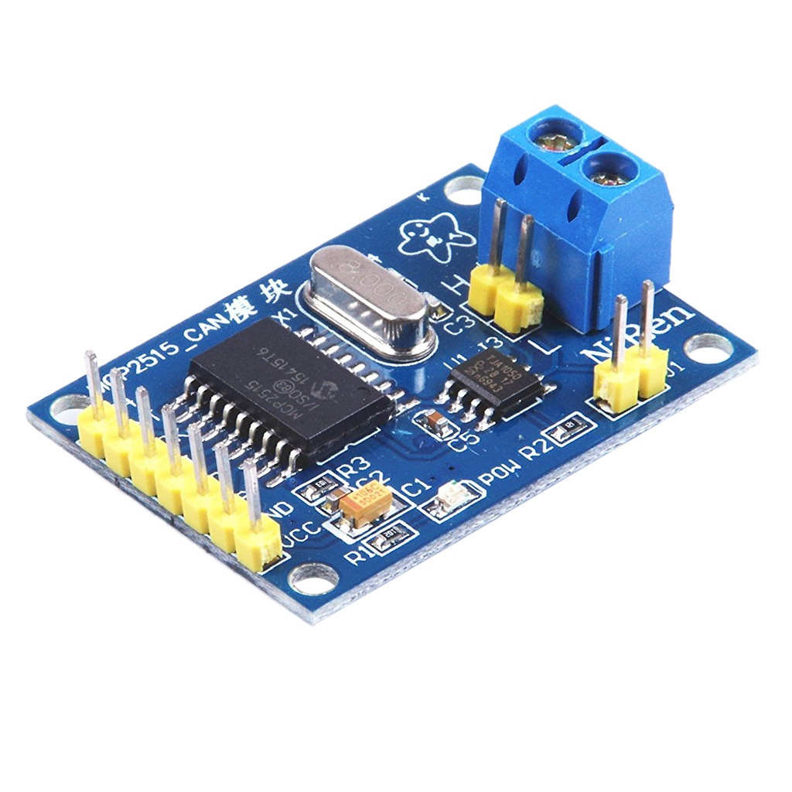
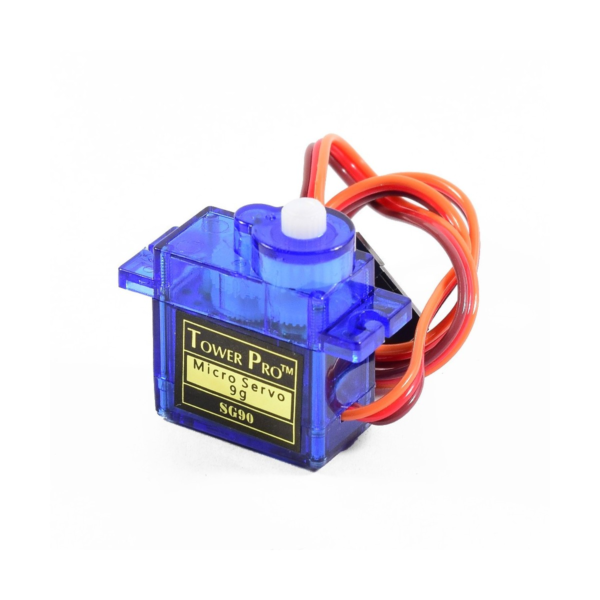
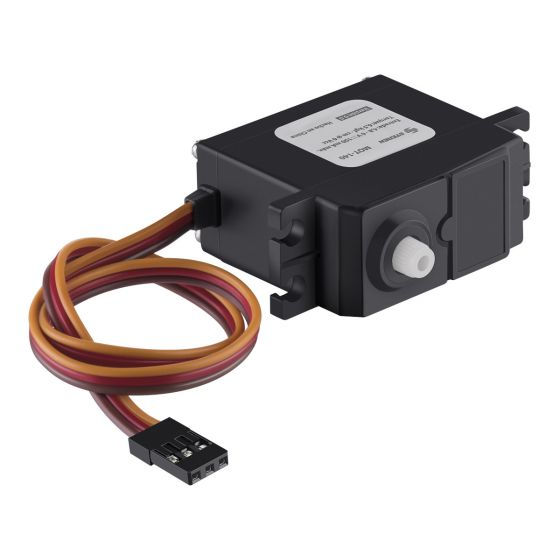
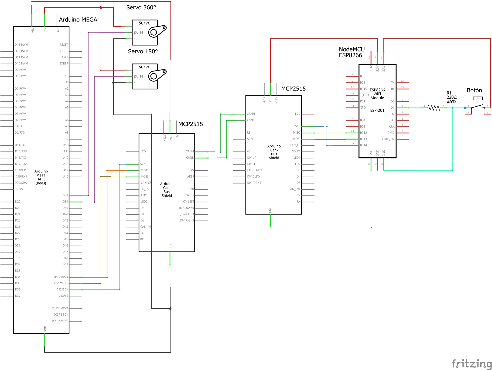
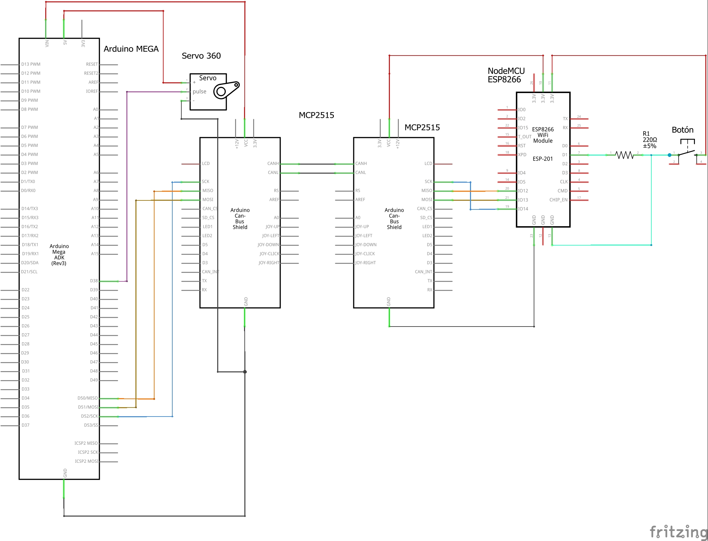

# Tractor Hood Manipulation
## Authors
This project was developed by:
- Nancy L. García Jiménez [@Supernovanan](https://github.com/Supernovanan)
- Daniela Avila Luna [@DannyAvilaL](https://github.com/DannyAvilaL)
- Roberto David Manzo González [@robertomanzo2203](https://github.com/robertomanzo2203)

## About
This repository contains the source codes, the schematic of connections and the libraries necessaries for the implementation of a prototipe to manipulate the state of the hood of a tractor using the CAN communication protocol and with communication with the Arduino IoT Cloud.

## Hardware
We used 2 microcontrollers for this implementation. 
- Arduino Mega 2560
- NodeMCU Esp8266 (*Esp32 is highly recommended for this implementation*)

For the CAN protocol, we used the transceivers MCP2515.

For the actuators we used
- 1 servomotor SG90

- 1 continuous servomotor

## Code

### Libraries
For the Mega, is important having the library used for the FreeRTOS implementation:
- FreeRTOS (*It can be downloaded from the library administrator from the Arduino IDE.*)

For the NodeMCU, since it works with the Arduino IoT Cloud, is a must having the following library, also available in the IDE library administrator:
- ArduinoIoTCloud (*install dependencies also [Arduino ConnectionHandler library]*)

For both microcontrollers, Mega and NodeMCU, is important the use of the following CAN library, since is the only one compatible with the model of Node used in this implementation (Esp8266).
- Arduino MCP2515 (https://github.com/autowp/arduino-mcp2515)

**Note:** *Make sure to have the libraries in the correct libraries path in order to make it work and prevent errors.*

### Which code to use
For the microcontroller connected to the IoT Cloud, use the code in the NodeMCUEsp8266 folder.
For the microcontroller connected to the servomotors, use:
- **ArduinoMega2560_OneServo** if you will only use 1 continuous servomotor
- **ArduinoMega2560_TwoServo** if you will use both servomotors

## Schematic
In the following pictures, it's visible how the connections were made.

Using 2 servomotors:

Using 1 servomotor:

## Arduino IoT Cloud Connection
For the reference on how to connect the NodeMCU to the IoT Cloud, please refer to the following tutorial from Arduino: https://docs.arduino.cc/cloud/iot-cloud/tutorials/esp-32-cloud

**Note**: *Make sure to **NOT** modify the name generated in the paltform for the device, until this day (01/12/2021) changing the name generates error connections.*
